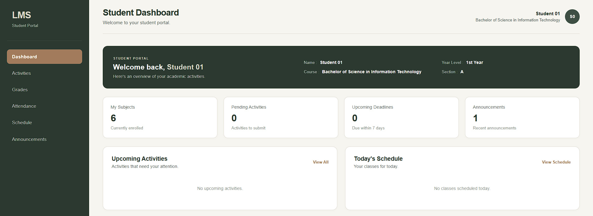

# University Learning Management System

<p align="center">
  
</p>

<p align="center">
  A role-based University Learning Management System built with HTML, CSS, and JavaScript.
</p>

<p align="center">
  
  
  
  
</p>

---

## About the Project

The University Learning Management System is a web-based academic management application designed to provide separate dashboards for administrators, faculty, and students.

The system demonstrates frontend development, role-based functionality, client-side data management, dynamic interfaces, and persistent browser storage using JavaScript `localStorage`.

---

## Features

### Admin Dashboard
- Manage students and faculty
- Manage departments, courses, sections, and subjects
- Manage class schedules
- Create and manage system announcements

### Faculty Dashboard
- View assigned classes
- Manage class activities
- Review student submissions
- Enter and manage grades
- Track attendance
- Manage class announcements
- View class schedules

### Student Dashboard
- View enrolled subjects
- View class activities
- Submit activities
- View grades
- View attendance records
- View class schedules
- View announcements

---

## User Roles

| Role | Main Functions |
|------|----------------|
| Admin | Manage users, academic structure, schedules, and announcements |
| Faculty | Manage classes, activities, grades, attendance, and announcements |
| Student | View subjects, activities, grades, attendance, schedules, and announcements |

---

## Technologies Used

### Frontend
- HTML5
- CSS3
- JavaScript

### Data Storage
- Browser LocalStorage

### Development
- Visual Studio Code
- Git
- GitHub

---

## System Highlights

### Role-Based Dashboards

Each user role has a dedicated dashboard and set of available features.

### Activity & Submission Management

Faculty can create activities while students can submit their work through the Student Dashboard. Faculty can then review submissions and assign grades.

### Grade Management

The system calculates and displays student grades based on recorded academic activities and attendance.

### Attendance Management

Faculty can record attendance using the following statuses:

- Present — 100
- Late — 75
- Absent — 0
- Excused — 100

### Announcements

Announcements can be created and displayed based on the intended audience and academic context.

### Persistent Login

The system maintains the user's login session through browser `localStorage` until the user logs out.

---

## Project Structure

```text
University-LMS/
│
├── log-in-page.html
│
├── 01-html/
│   ├── admin-dashboard.html
│   ├── faculty-dashboard.html
│   ├── student-dashboard.html
│   └── register.html
│
├── 02-css/
│   ├── login.css
│   ├── admin-dashboard.css
│   ├── faculty-dashboard.css
│   └── student-dashboard.css
│
├── 03-js/
│   ├── log-in-page.js
│   ├── admin-dashboard.js
│   ├── faculty-dashboard.js
│   └── student-dashboard.js
│
└── assets/
    └── lms-preview.png
